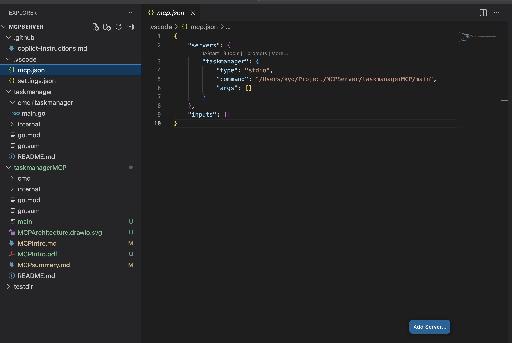
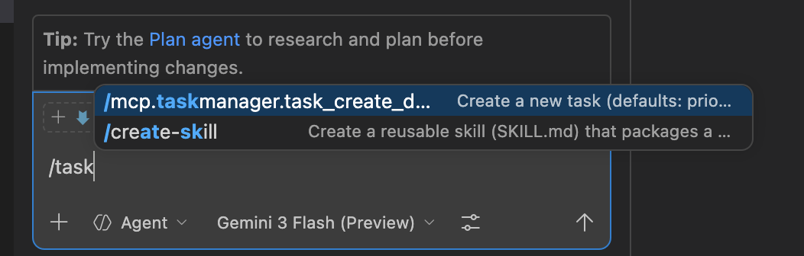
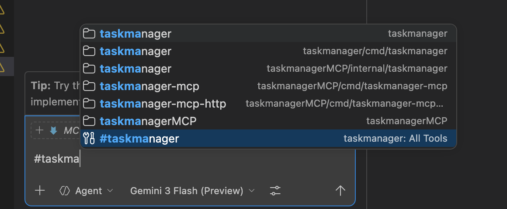

# MCP Introduction

---

# Why is MCP needed?

 
 

Need to Share **Context** with LLM **ModeL** to get better output

---

# MCP in One Line
  
 
 

**Model Context Protocol (MCP)** is an open-source standard for connecting AI applications to external systems.

---
# MCP Architecture

---

# MCP Standardization Layers

The protocol is split into two distinct layers:

1.  **Data Layer**
    - Defines message structure and semantics.
    - JSON-RPC 2.0 based exchange.
2.  **Transport Layer**
    - Manages communication channels.
    - Standardizes authorization.

---

# 1. Transport Layer

Managing communication between clients and servers:

## Transport
- **Stdio**: Standard input/output (ideal for local/CLI).
- **Streamable HTTP**: SSE (Server-Sent Events) for networked environments.

## Authorization
- Standardized authc/z for MCP Server and MCP client

---

# 2. Data Layer

The data layer implements a JSON-RPC 2.0 based exchange protocol that defines the message structure and semantics

### What's defined 
- Primitive (Server and Client feature) 
- Lifecycle
- Notification

---

# 2. Data Layer: Primitives(Server)

Defining protocol for what servers can offer.

- **Tools**: Actions the AI can invoke (Operations, API calls).
- **Resources**: Data sources for context (Files, DB records).
- **Prompts**: Reusable templates for interaction.

---

# 2. Data Layer: Primitives(Client)

Defining protocol for what client can offer

- **Sampling**: Servers can request completions.
- **Elicitation**: Servers can ask users for more info.
- **Roots**: Exposing filesystem access points.
- **Logging**: Real-time debugging and monitoring.

---

# 2. Data Layer: Lifecycle

- MCP is a stateful protocol Since server/client should know which capability is supported.
- Lifecycle defines protocol for how to share each server's feature

---

# 2. Data Layer: Notification
  
 
 

Real time notification between client and server.eg: real time update for tools

---

# Developer Focus

MCP Frameworks handle the heavy lifting:
- ✅ Transport Layer management
- ✅ Lifecycle & Primitive Discovery
- ✅ Notification plumbing

**Developers can focus on:**
1.  Defining **Server Primitives** (Tools, Resources, Prompts).
2.  Leveraging **Client Primitives** in their implementations.

---

# MCP example 

### taskmanagerMCP

An MCP server for the `taskmanager` app, built with [`mark3labs/mcp-go`](https://github.com/mark3labs/mcp-go).
currently there is go-sdk: https://github.com/modelcontextprotocol/go-sdk

This server exposes tools that call the `taskmanager` HTTP API.  
taskmanager repo: https://github.com/kyo-ke/CleanArch.taskmanager

MCP repo: https://github.com/kyo-ke/taskmanagerMCP

---

# How to use from vscode (registration)

---

# How to use from vscode (execution)

### tools explicit execution

 

### prompt execution

---

# Thsnk you!
